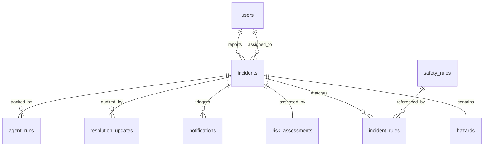

# Workplace SafetyWatch
### Multi-Agent Workplace Hazard Detection and Incident Management System

[](https://fastapi.tiangolo.com)
[](https://langchain-ai.github.io/langgraph/)
[](https://nextjs.org/)
[](https://groq.com/)
[](https://supabase.com/)
[](https://smith.langchain.com/)

---

## 1. Problem Statement

Industrial facilities (factories, warehouses, construction sites, and energy plants) experience thousands of preventable injuries annually due to unaddressed safety hazards. Standard reporting methods suffer from severe drawbacks:
- **Delayed Reporting:** Manual paper and generic ticketing take hours or days to route.
- **Subjective Risk Ratings:** Workers assign arbitrary risk levels without explainable rubrics.
- **Ambiguous Remediation:** Workers lack immediate access to the exact compliance standards and actionable steps.
- **Disconnected Tracking:** Management has fragmented visibility into active remediation lifecycles.

---

## 2. Solution Summary

**Workplace SafetyWatch** is an end-to-end, multi-agent AI system. When an employee uploads an image and description:
1. Seven specialized LangGraph agents sequentially inspect the hazard, categorize its taxonomy, calculate an explainable risk score $(0-100)$, match curated compliance rules, compile a formal incident report (`WS-XXXX`), and notify the responsible safety manager.
2. The Next.js frontend displays the live progression of all 7 agents (`waiting` $\to$ `running` $\to$ `completed` $\to$ `failed`).
3. Safety managers access an interactive portal to inspect full AI analysis, assign responsible officers, update progress statuses, record audit notes, and mark incidents resolved.

---

## 3. Key Features

- 🤖 **7-Agent LangGraph Pipeline:** True distributed agent nodes (Detection, Classification, Risk Assessment, Rule Matching, Report Generation, Notification, Resolution).
- ⚡ **Groq Vision & Multimodal Inference:** Ultra-fast visual hazard detection with Llama 3.2 Vision.
- 📐 **Explainable Risk Rubric:** Mathematical matrix formulation: $\text{Risk Score} = (S \times L / 25) \times 100 + \text{Category Weight}$.
- 🛡️ **Safety Rule & Compliance Matching:** Automatic correlation against curated safety standards with specific corrective actions.
- 📊 **Confidence & Evaluation Metrics:** Transparent scoring (Detection, Classification, Rule Match, Risk Assessment) with explicit evaluation disclaimers.
- 📬 **Transparent Escalation Notifications:** Explicitly labeled `"simulated"` or `"actually sent"` manager alerts for High/Critical incidents.
- 📱 **Real-time Live Progression UI:** Animated status indicators tracking each agent node execution in real time.
- 🔍 **Manager Lifecycle Management:** Filter, assign, triage, and record resolution audit logs.
- 📈 **KPI Safety Analytics Dashboard:** Total, open, high-risk, resolved counts, and category distributions.

---

## 4. System Architecture

```mermaid
graph TD
    A[Employee / Manager] <--> B[Next.js Frontend (Vercel)]
    B <-->|REST API / CORS| C[FastAPI Backend (Railway)]
    
    subgraph "LangGraph 7-Agent Engine"
        C --> D[1. Hazard Detection Agent]
        D -->|Hazard Detected| E[2. Hazard Classification Agent]
        D -->|No Hazard| SAFE[No Hazard Early Exit Node]
        E --> F[3. Risk Assessment Agent]
        F --> G[4. Safety Rule & Compliance Agent]
        G --> H[5. Incident Report Agent]
        H --> I[6. Notification Agent]
        I --> J[7. Resolution Tracking Agent]
    end

    subgraph "External Intelligence & Storage"
        D -.-> K[Groq Vision / LLM API]
        E -.-> K
        F -.-> K
        G -.-> K
        C <--> L[(Supabase Postgres & Storage)]
        C -.-> M[LangSmith Distributed Traces]
    end
```

---

## 5. Multi-Agent Pipeline Breakdown

| # | Agent Name | Node File | Role & Primary Responsibility |
| :-: | :--- | :--- | :--- |
| **1** | **Hazard Detection** | `agents/detection.py` | Analyzes image & text to confirm hazard presence; returns confidence. |
| **2** | **Hazard Classification** | `agents/classification.py` | Categorizes into: *Electrical, Fire, PPE, Slip/Trip, Machinery, Chemical, Emergency Exit, Structural, Housekeeping, Other*. |
| **3** | **Risk Assessment** | `agents/risk_assessment.py` | Computes Severity ($1-5$), Likelihood ($1-5$), Risk Score ($0-100$), Priority, and explainable rationale. |
| **4** | **Safety Rule Matching** | `agents/safety_rules.py` | Matches against curated safety guidelines; provides corrective action. *(Feature name: "Safety Rule & Compliance Matching")*. |
| **5** | **Incident Report** | `agents/incident_report.py` | Generates unique code (`WS-XXXX`) and structured incident summary object. |
| **6** | **Notification** | `agents/notification.py` | Dispatches manager alerts for High/Critical risks (status labeled `"simulated"` or `"actually sent"`). |
| **7** | **Resolution Tracking** | `agents/resolution.py` | Tracks remediation lifecycle, assignee updates, and status changes. |

---

## 6. Database Schema (Supabase PostgreSQL)



- **`incidents`**: Central incident record (`id`, `incident_code`, `location`, `description`, `hazard_detected`, `hazard_type`, `category`, `risk_score`, `severity`, `priority`, `status`, `assignee_name`, timestamps).
- **`hazards`**: Visual telemetry and detected condition (`incident_id`, `image_path`, `detected_description`).
- **`risk_assessments`**: Rubric calculations (`severity_score`, `likelihood`, `risk_score`, `priority`, `rationale`).
- **`safety_rules`**: Curated safety compliance catalogue (`id`, `code`, `title`, `description`, `category`, `default_corrective_action`).
- **`incident_rules`**: Junction table storing matched rule justification and compliance status.
- **`notifications`**: Alert logs (`recipient`, `channel`, `status`, `sent_at`).
- **`resolution_updates`**: Immutable audit logs of status transitions and corrective actions.
- **`agent_runs`**: Execution state logs for observability and troubleshooting.

---

## 7. API Reference

| Method | Endpoint | Description |
| :--- | :--- | :--- |
| `POST` | `/api/incidents/analyze` | Upload image & data; triggers full 7-agent LangGraph workflow. |
| `GET` | `/api/incidents` | Filter incidents by `status`, `severity`, `category`, or `search`. |
| `GET` | `/api/incidents/{id}` | Retrieve complete incident detail and agent audit history. |
| `PATCH` | `/api/incidents/{id}` | Manager update: status (`IN_PROGRESS`, `RESOLVED`), assignee, notes. |
| `GET` | `/api/dashboard/stats` | Retrieve aggregate KPI metrics and category counts. |
| `GET` | `/api/incidents/{id}/progress` | Real-time agent status tracker (`waiting`, `running`, `completed`). |
| `GET` | `/api/safety-rules` | Retrieve curated safety compliance standards catalog. |
| `GET` | `/health` | Service health and external integration check. |

---

## 8. Local Setup & Quickstart

### Prerequisites
- Python 3.10+
- Node.js 18+ and npm
- Git

### 1. Clone & Environment Setup
```bash
git clone https://github.com/your-username/workplace-safetywatch.git
cd workplace-safetywatch

# Copy environment example
cp .env.example .env
```

### 2. Backend Setup
```bash
cd backend
python -m venv .venv

# Windows
.\.venv\Scripts\activate
# Linux / macOS
source .venv/bin/activate

pip install -r requirements.txt
uvicorn app.main:app --reload --port 8000
```
Backend API will be accessible at `http://localhost:8000` (Swagger docs at `http://localhost:8000/docs`).

### 3. Frontend Setup
```bash
cd ../frontend
npm install
npm run dev
```
Frontend UI will be accessible at `http://localhost:3000`.

---

## 9. Environment Variables

Create a `.env` file in the root or `backend/` directory:

```env
# Groq LLM API Key (required for vision/text inference)
GROQ_API_KEY=your_groq_api_key_here

# Supabase Credentials (optional for cloud persistence; fallback store active if empty)
SUPABASE_URL=https://your-project-id.supabase.co
SUPABASE_KEY=your_supabase_anon_or_service_key_here

# LangSmith Tracing
LANGCHAIN_TRACING_V2=true
LANGCHAIN_PROJECT=workplace-safetywatch
LANGCHAIN_API_KEY=your_langsmith_api_key_here
LANGCHAIN_ENDPOINT=https://api.smith.langchain.com

# Server Settings
PORT=8000
HOST=0.0.0.0
NEXT_PUBLIC_API_URL=http://localhost:8000
```

---

## 10. Automated Testing

Run the full backend test suite using `pytest`:

```bash
cd workplace-safetywatch
.\backend\.venv\Scripts\pytest -v tests/
```

### Test Coverage includes:
- ✅ Health checks and API routes
- ✅ Demo Scenario 17 (Exposed electrical wires $\to$ High risk $\to$ Alert)
- ✅ Conditional routing & early exit (Clean safe lobby $\to$ No hazard)
- ✅ Explainable risk rubric mathematical unit calculations
- ✅ Error handling (Invalid file format, oversized file $>10\text{MB}$, 404 lookups)
- ✅ Manager lifecycle (Creation $\to$ Assignment $\to$ In Progress $\to$ Resolved)

---

## 11. End-to-End Demo Walkthrough

1. **Step 1 — Report:** Select the quick preset *"⚡ Exposed Electrical Wires"* or upload a photo at location *"Electrical Room B2"*.
2. **Step 2 — Live Pipeline:** Observe the 7 LangGraph agent statuses transition live in the UI timeline.
3. **Step 3 — Report Inspection:** Review the generated incident code (e.g. `WS-1024`), High risk score ($88/100$), matched rule `SAFE-ELEC-101`, and simulated manager alert.
4. **Step 4 — Manager Portal:** Switch to the Manager Portal tab, click **"Inspect"** on the new incident.
5. **Step 5 — Assignment & Remediation:** Assign to *"John Doe (Senior Electrician)"*, change status to *"IN_PROGRESS"*, and add notes: *"De-energized panel and installed insulated protective conduit."*
6. **Step 6 — Resolution:** Click **"One-Click Mark Resolved"**. Confirm status updates to `RESOLVED` and KPIs refresh automatically in Analytics.

---

## 12. LangSmith Observability

LangSmith tracing is integrated into the LangGraph workflow. To view live traces during demos:
1. Provide `LANGCHAIN_API_KEY` in `.env`.
2. Open the [LangSmith Console](https://smith.langchain.com) under project `workplace-safetywatch`.
3. Inspect the execution graph, node latencies, token consumption, and input/output states for every agent invocation.

---

## 13. Graphify Architecture Analysis

A structural graph analysis of the entire codebase is located in `/graphify`:
- [`graphify/REPORT.md`](graphify/REPORT.md): Relationship matrices and component interaction diagrams.
- [`graphify/architecture_graph.json`](graphify/architecture_graph.json): Machine-readable node and edge graph definitions.

---

## 14. Obsidian Documentation Vault

A connected Obsidian knowledge base is available in `/docs`:
- Open `/docs` as a local vault in [Obsidian](https://obsidian.md).
- Explore interlinked notes using the **Graph View** covering Architecture, Agent Design, Risk Rubrics, Schema, and Testing.

---

## 15. Deployment

### Backend (Railway)
1. Link your GitHub repository to [Railway](https://railway.app).
2. Set root directory to `/backend` (or use the root `backend/railway.json`).
3. Set environment variables (`GROQ_API_KEY`, `SUPABASE_URL`, `SUPABASE_KEY`).

### Frontend (Vercel)
1. Import repository to [Vercel](https://vercel.com).
2. Set root directory to `frontend`.
3. Set `NEXT_PUBLIC_API_URL` to your Railway backend URL.

---

## 16. UI Screenshots

| Employee Hazard Submission & Live Pipeline | Manager Portal & Incident Remediation |
| :---: | :---: |
| ** | ** |

---

## 17. License & Disclaimer

This software is distributed under the MIT License.
*Disclaimer: Workplace SafetyWatch provides automated safety recommendations based on internal best practices and AI model evaluation. It does not constitute certified legal or governmental OSHA regulatory compliance certification.*
