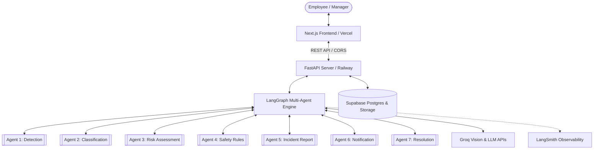

# Architecture

The system architecture follows a decoupled, resilient microservices approach:

## Component Topology

## Layers
1. **Frontend:** React, Next.js App Router, Tailwind CSS, Lucide icons.
2. **Backend Gateway:** FastAPI async server with strict Pydantic models ([[API Documentation]]).
3. **Multi-Agent Pipeline:** Seven dedicated nodes orchestrated by [[LangGraph Workflow]].
4. **Data Persistence:** Relational tables and image bucket storage in [[Supabase Schema]].
5. **Observability:** Distributed tracing and latency tracking via LangSmith.

See also: [[Agent Design]], [[LangGraph Workflow]], [[Supabase Schema]], [[Deployment]].
