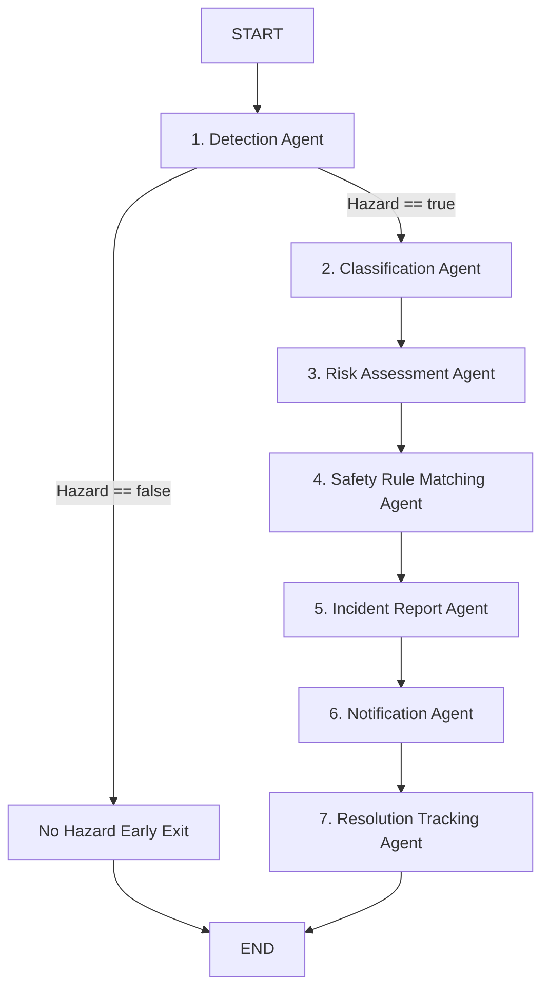

# LangGraph Workflow

The multi-agent execution pipeline is defined as a directed `StateGraph` in `backend/app/agents/workflow.py`.

## State Definition (`SafetyWatchState`)
- `image_url`, `image_base64`, `description`, `location`, `reporter`
- `hazard`, `hazard_description`, `detection_confidence`
- `category`, `hazard_type`, `classification_confidence`
- `severity`, `likelihood`, `severity_score`, `risk_score`, `priority`, `risk_rationale`
- `matched_rules`, `rule_match_confidence`
- `incident_id`, `incident_code`, `incident_report`, `incident_status`
- `notification_status`, `notification_detail`
- `resolution_updates`, `assignee_name`, `assignee_id`
- `agent_statuses` (keys: `detection`, `classification`, `risk`, `rules`, `report`, `notification`, `resolution`)
- `confidence_metrics`, `errors`

## Resilience and Retries
Every node is wrapped in a `safe_node_runner` that:
1. Retries transient API errors (e.g. LLM timeout) once.
2. Updates `agent_statuses.<node> = "running"` $\to$ `"completed"` (or `"failed"`).
3. Records graceful fallback diagnostic notices in `state.errors` without halting the entire system.

See also: [[Agent Design]], [[Architecture]], [[Evaluation]].
