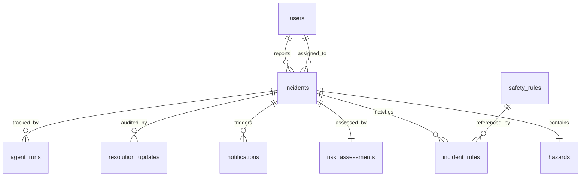

# Supabase Schema

The database schema is implemented in PostgreSQL and hosted on Supabase (with fallback in-memory SQLite synchronization in `backend/app/db/store.py`).

## Relational Tables
1. `users` (`id`, `name`, `role [employee|manager]`, `email`, `created_at`)
2. `incidents` (`id`, `incident_code`, `reporter_id`, `reporter_name`, `location`, `description`, `hazard_detected`, `hazard_type`, `category`, `confidence`, `risk_score`, `severity`, `priority`, `status`, `assignee_id`, `assignee_name`, `created_at`, `updated_at`)
3. `hazards` (`id`, `incident_id`, `image_path`, `detected_description`, `detection_confidence`, `created_at`)
4. `risk_assessments` (`id`, `incident_id`, `severity`, `likelihood`, `severity_score`, `risk_score`, `priority`, `rationale`, `created_at`)
5. `safety_rules` (`id`, `code`, `title`, `description`, `category`, `standard_reference`, `default_corrective_action`, `created_at`)
6. `incident_rules` (`id`, `incident_id`, `rule_id`, `why_it_applies`, `compliance_status`, `corrective_action`, `created_at`)
7. `notifications` (`id`, `incident_id`, `recipient`, `channel`, `status [simulated|actually sent|skipped|failed]`, `subject`, `message`, `sent_at`)
8. `resolution_updates` (`id`, `incident_id`, `updated_by`, `notes`, `status`, `created_at`)
9. `agent_runs` (`id`, `incident_id`, `agent_name`, `status`, `started_at`, `completed_at`, `error`)

## Storage Bucket
- Bucket Name: `hazard-images`
- Format: Uploaded binary images stored in S3/Supabase Storage; only relative references stored in `hazards.image_path`.

See also: [[Architecture]], [[API Documentation]].
