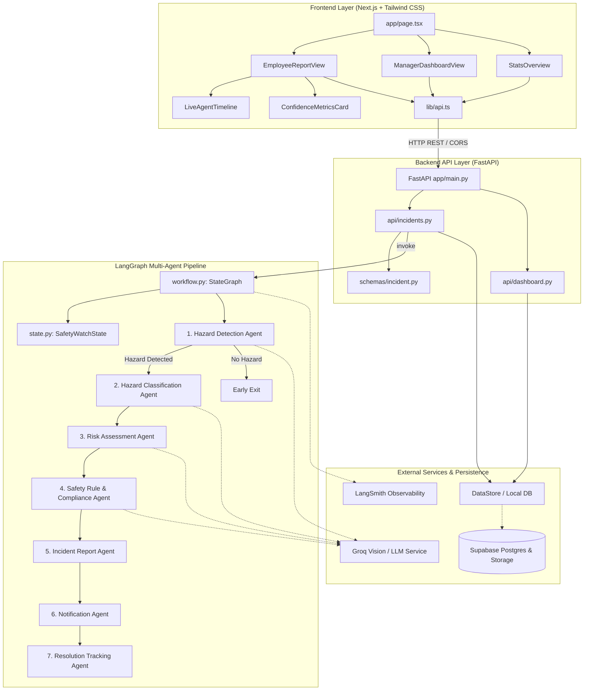

# Graphify Architectural Analysis Report: Workplace SafetyWatch

## 1. Executive Summary

This Graphify relationship analysis maps the end-to-end multi-agent software architecture of **Workplace SafetyWatch**. The system decouples interactive client reporting (Next.js), high-throughput asynchronous execution (FastAPI), sequential/conditional AI orchestration (LangGraph), resilient persistence (Supabase Postgres & Storage), and complete lifecycle observability (LangSmith).

---

## 2. Key Architecture Relationships

| Component | Connected To | Protocol / Dependency | Purpose |
| :--- | :--- | :--- | :--- |
| `EmployeeReportView` | `LiveAgentTimeline` | React Props | Live rendering of agent execution states (`waiting` $\to$ `running` $\to$ `completed` $\to$ `failed`) |
| `lib/api.ts` | `FastAPI (app/main.py)` | HTTP Fetch | Multipart image upload and REST querying |
| `api/incidents.py` | `LangGraph (workflow.py)` | In-process Python | Orchestration of 7 specialized agent nodes |
| `RiskAssessmentAgent` | Explainable Rubric Formula | Python Logic / Groq | Computes $(S \times L / 25) \times 100$ risk score |
| `SafetyRuleAgent` | `safety_rules_data.py` | Relational Search | Compliance standard matching and corrective action |
| `NotificationAgent` | Simulation / Alert Log | Internal Dispatch | Manager escalation for High/Critical incidents |
| `workflow.py` | `LangSmith` | OpenTelemetry Traces | Emits execution step latencies and run traces |
